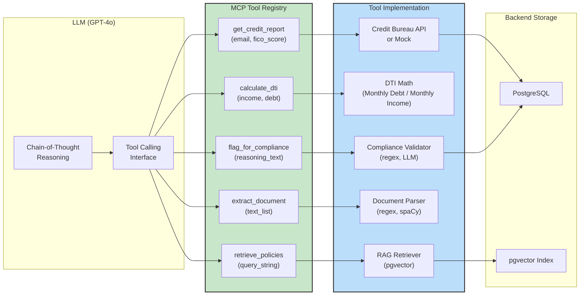
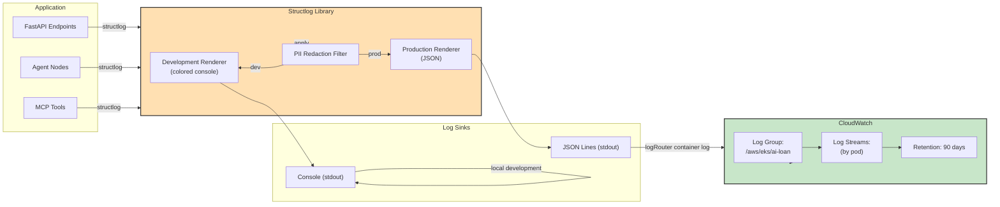
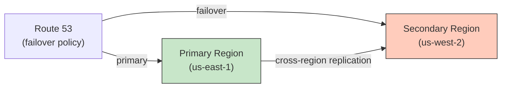
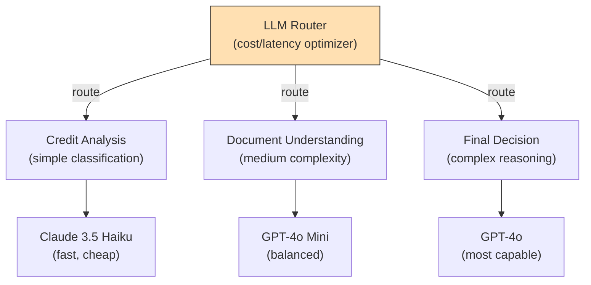

# Enterprise AI Loan Decision Assistant – Architecture Design Document

> **Prepared for:** Principal AI Engineer Technical Review  
> **Classification:** Internal Technical Documentation  
> **Version:** 1.0  
> **Date:** July 2026

---

## Executive Summary

This document describes the complete architecture for the **Enterprise AI Loan Decision Assistant**, an agentic AI system designed to evaluate residential mortgage applications with explainability, compliance, and enterprise-grade observability.

**Key Design Principles:**
- **Explainability First**: Every decision includes a full audit trail of agent reasoning
- **Compliance by Design**: Fair-lending guardrails at multiple layers (input, output, real-time)
- **State-Machine Clarity**: Loan analysis workflow modeled as a directed acyclic graph (DAG)
- **Observability as Infrastructure**: OpenTelemetry instrumentation throughout
- **PostgreSQL-Native RAG**: pgvector for semantic search without external vector databases
- **Model Context Protocol**: Tool standardization for future interoperability

---

## 1. High-Level Architecture Diagram

```mermaid
graph TB
    Client["Client Application"]
    
    subgraph Gateway["API Gateway & Middleware"]
        HealthCheck["Health Check Endpoints"]
        RequestLog["Request/Response Logging"]
        InputGuards["Input Guardrails<br/>(PII, Validation)"]
    end
    
    subgraph FastAPI["FastAPI Application"]
        LoanAnalyzeEndpoint["POST /api/v1/loans/analyze"]
    end
    
    subgraph Orchestration["LangGraph Orchestrator"]
        StateManager["State Machine<br/>(LoanState)"]
        CreditAgent["Credit Agent"]
        DocAgent["Document Agent"]
        PolicyAgent["Policy Agent<br/>(RAG)"]
        DecisionAgent["Decision Agent"]
    end
    
    subgraph Tools["MCP Tool Layer"]
        Tool1["get_credit_report"]
        Tool2["calculate_dti"]
        Tool3["retrieve_policies"]
        Tool4["extract_document"]
        Tool5["flag_for_compliance"]
    end
    
    subgraph DataLayer["Data & Knowledge"]
        PgSQL["PostgreSQL 16<br/>(Transactional)"]
        PgVector["pgvector<br/>(Policy Embeddings)"]
        RAGRetriever["Semantic Retriever"]
    end
    
    subgraph GuardrailsLayer["Guardrails & Evaluation"]
        OutputGuards["Output Guardrails<br/>(Bias, Structure)"]
        Evaluator["Response Evaluator"]
    end
    
    subgraph Observability["Observability Stack"]
        Logging["Structured Logging<br/>(structlog)"]
        Telemetry["OpenTelemetry Collector"]
        Traces["Jaeger / AWS X-Ray"]
    end
    
    Client -->|HTTP Request| Gateway
    Gateway -->|Valid Request| FastAPI
    FastAPI -->|Dispatch| Orchestration
    Orchestration -->|State Flow| CreditAgent
    CreditAgent -->|Tool Calls| Tools
    Tools -->|Query| DataLayer
    DocAgent -->|Tool Calls| Tools
    PolicyAgent -->|RAG Query| RAGRetriever
    RAGRetriever -->|Cosine Similarity| PgVector
    Orchestration -->|Final Decision| DecisionAgent
    DecisionAgent -->|Safety Checks| GuardrailsLayer
    GuardrailsLayer -->|Audit & Metrics| Observability
    Observability -->|Trace Export| Traces
    GuardrailsLayer -->|Response| Client
    
    style Client fill:#f9f,stroke:#333,stroke-width:2px
    style Orchestration fill:#0af,stroke:#333,stroke-width:2px
    style DataLayer fill:#fa0,stroke:#333,stroke-width:2px
    style Observability fill:#0f0,stroke:#333,stroke-width:2px

---

## 2. Component Architecture Diagram

```mermaid
graph LR
    subgraph API Layer
        FastAPI["FastAPI<br/>uvicorn"]
        MiddleWare["Middleware Stack<br/>(Logging, Correlation IDs)"]
    end
    
    subgraph Agent Layer
        Orch["LangGraph<br/>Orchestrator"]
        CA["Credit<br/>Agent"]
        DA["Document<br/>Agent"]
        PA["Policy<br/>Agent"]
        DCA["Decision<br/>Agent"]
    end
    
    subgraph Integration Layer
        MCP["MCP Tool<br/>Registry"]
        LLM["LangChain<br/>OpenAI LLM<br/>Integration"]
        RAG["RAG Pipeline<br/>Embeddings"]
    end
    
    subgraph Persistence Layer
        PG["PostgreSQL<br/>Connection Pool<br/>AsyncPG"]
        VectorDB["pgvector<br/>Extension"]
    end
    
    subgraph Resilience & Quality
        Guard["Guardrails<br/>(Input/Output)"]
        Eval["Evaluator<br/>(Quality Scoring)"]
        Vault["Secrets Manager<br/>(JWT, API Keys)"]
    end
    
    subgraph Observability Layer
        StructLog["Structured<br/>Logging"]
        OTEL["OpenTelemetry<br/>Instrumentation"]
        Tracer["Distributed<br/>Tracing"]
    end
    
    FastAPI --> MiddleWare
    MiddleWare --> Orch
    Orch --> CA
    Orch --> DA
    Orch --> PA
    Orch --> DCA
    CA --> MCP
    DA --> MCP
    PA --> RAG
    MCP --> LLM
    RAG --> LLM
    MCP --> PG
    RAG --> VectorDB
    CA --> Guard
    DA --> Guard
    PA --> Guard
    DCA --> Guard
    DCA --> Eval
    Guard --> StructLog
    Eval --> StructLog
    StructLog --> OTEL
    OTEL --> Tracer
    Vault -.->|Secret Injection| LLM
    Vault -.->|Secret Injection| PG
    
    style API\ Layer fill:#e1f5ff,stroke:#333
    style Agent\ Layer fill:#f3e5f5,stroke:#333
    style Integration\ Layer fill:#fff3e0,stroke:#333
    style Persistence\ Layer fill:#e8f5e9,stroke:#333
    style Observability\ Layer fill:#fce4ec,stroke:#333

---

## 3. Request Lifecycle Sequence Diagram

```mermaid
sequenceDiagram
    participant Client
    participant FastAPI
    participant InputGuard as Input Guardrails
    participant Orch as LangGraph
    participant CreditA as Credit Agent
    participant DocA as Document Agent
    participant PolicyA as Policy Agent
    participant DecisionA as Decision Agent
    participant OutputGuard as Output Guardrails
    participant Logger as Observability
    
    Client->>FastAPI: POST /api/v1/loans/analyze<br/>(applicant data)
    
    FastAPI->>InputGuard: Validate & scan for PII
    alt PII Detected
        InputGuard-->>FastAPI: 400 Bad Request
        FastAPI-->>Client: Error Response
    else Valid
        InputGuard-->>FastAPI: Pass
    end
    
    FastAPI->>Orch: Create LoanState<br/>Start graph execution
    
    Orch->>CreditA: Execute credit_node
    Note over CreditA: FICO + DTI analysis
    CreditA->>Logger: Emit trace span
    CreditA-->>Orch: credit_findings
    
    par Parallel Execution
        Orch->>DocA: Execute document_node
        Note over DocA: Extract income docs
        DocA-->>Orch: document_findings
    and
        Orch->>PolicyA: Execute policy_node (RAG)
        Note over PolicyA: pgvector similarity search
        PolicyA-->>Orch: policy_context + findings
    end
    
    Orch->>DecisionA: Execute decision_node<br/>(all findings in state)
    Note over DecisionA: Synthesis + reasoning
    DecisionA-->>Orch: final decision
    
    Orch->>OutputGuard: Validate & bias-check
    OutputGuard->>Logger: Emit quality metrics
    alt Bias Detected
        OutputGuard-->>Orch: Flag for manual review
    else Safe
        OutputGuard-->>Orch: Pass
    end
    
    Orch-->>FastAPI: LoanDecisionResponse
    FastAPI->>Logger: Record audit log
    FastAPI-->>Client: 200 + decision JSON
    
    Logger->>Logger: Batch send traces to OTLP collector

---

## 4. Request Lifecycle (Textual)

The loan analysis request flows through the system in the following phases:

### Phase 1: Ingress & Validation (0–50ms)
- **HTTP Request Received**: FastAPI endpoint receives POST with applicant data
- **Input Guardrails**: 
  - Detect PII (SSN patterns, credit card numbers, passport IDs)
  - Validate field ranges (annual income > 0, DTI reasonable bounds)
  - Whitelist loan purposes (home_purchase, refinance, cash_out, home_equity)
  - Rate limiting (token bucket: 1000 req/min per client IP)
- **Request Correlation**: Assign X-Request-ID, inject into context

### Phase 2: State Graph Initialization (50–100ms)
- **LoanState Creation**: Immutable TypedDict with all shared state
- **Graph Compilation**: LangGraph compiles the DAG (one-time, cached)
- **Span Creation**: OpenTelemetry tracer creates root span with correlation ID

### Phase 3: Agent Execution (100–2500ms)

**Sequential → Parallel → Sequential Pattern:**

1. **credit_node** (sequential, blocks document_node)
   - Calls `get_credit_report(applicant_email, credit_score)` MCP tool
   - Calls `calculate_dti(annual_income, monthly_debt)` MCP tool
   - LLM enrichment: Chain-of-thought reasoning on FICO + DTI
   - Outputs: `credit_findings` dict with risk_tier, recommendation, confidence

2. **document_node** (parallel, starts after credit_node)
   - Calls `extract_document_data(document_texts)` MCP tool
   - LLM enrichment: Verify income consistency, doc quality assessment
   - Outputs: `document_findings` dict with income_verified, doc_quality_score

3. **policy_node** (parallel, starts after credit_node)
   - RAG Query: Embed "applicant profile summary" → cosine search pgvector
   - Retrieval: Top-K=5 policy chunks (similarity threshold 0.70)
   - LLM enrichment: Verify compliance, identify manual review triggers
   - Outputs: `policy_findings` with compliance_status, manual_triggers

4. **decision_node** (sequential, waits for policy_node)
   - All findings now in `state`: credit_findings, document_findings, policy_findings
   - LLM synthesizes across all agents: final recommendation
   - Calls `flag_for_compliance()` MCP tool for ECOA/FHA checks
   - Outputs: `decision` dict with recommendation, explanation, confidence_score

### Phase 4: Guardrails & Quality (2500–2600ms)
- **Output Guardrails**:
  - Structural validation (all required fields present)
  - Bias scanning: Check explanation text for protected-class mentions
  - Confidence bounds: Ensure 0.0–1.0 range
  - Rate limiting on responses (prevent token exhaustion)
- **Response Evaluator**:
  - Score response quality (consistency across agent_steps, reasoning coherence)
  - Flag low-confidence or contradictory decisions
  - Record metrics for monitoring

### Phase 5: Response & Audit (2600–2700ms)
- **JSON Response Construction**: LoanDecisionResponse with agent_steps array
- **Audit Log**: Write to PostgreSQL audit table with full request/response/decision
- **Trace Export**: OpenTelemetry SDK batches spans to OTLP collector (async)
- **HTTP Response**: Return 200 + JSON

**Total SLA: < 3 seconds (p99)**

---

## 5. Agent Interaction Diagram

```mermaid
graph TB
    subgraph LoanState["Shared LoanState"]
        Input["Input:<br/>applicant_name, email,<br/>annual_income, credit_score"]
        CreditFindings["credit_findings:<br/>risk_tier, dti, recommendation"]
        DocFindings["document_findings:<br/>income_verified, quality_score"]
        PolicyFindings["policy_findings:<br/>compliance_status, triggers"]
        Decision["decision:<br/>recommendation, explanation,<br/>confidence_score"]
        Errors["errors:<br/>[] error log"]
    end
    
    subgraph Agents
        CreditAgent["🤖 Credit Agent<br/>(async)"]
        DocAgent["🤖 Document Agent<br/>(async)"]
        PolicyAgent["🤖 Policy Agent<br/>(async RAG)"]
        DecisionAgent["🤖 Decision Agent<br/>(async)"]
    end
    
    Input -->|read| CreditAgent
    CreditAgent -->|enrich| CreditFindings
    
    Input -->|read| DocAgent
    CreditFindings -->|read| DocAgent
    DocAgent -->|enrich| DocFindings
    
    Input -->|read| PolicyAgent
    CreditFindings -->|read| PolicyAgent
    PolicyAgent -->|enrich| PolicyFindings
    
    CreditFindings -->|read| DecisionAgent
    DocFindings -->|read| DecisionAgent
    PolicyFindings -->|read| DecisionAgent
    Input -->|read| DecisionAgent
    DecisionAgent -->|enrich| Decision
    
    CreditAgent -.->|error| Errors
    DocAgent -.->|error| Errors
    PolicyAgent -.->|error| Errors
    DecisionAgent -.->|error| Errors
    
    style LoanState fill:#f0f0f0,stroke:#333,stroke-width:2px
    style Agents fill:#e3f2fd,stroke:#333,stroke-width:2px

---

## 6. Data Flow Architecture

```mermaid
graph LR
    subgraph Input
        JSONReq["JSON Request<br/>Loan Application"]
    end
    
    subgraph Validation
        PII["PII Detection<br/>(regex patterns)"]
        Range["Range Validation<br/>(income, debt bounds)"]
        Enum["Enum Validation<br/>(loan_purpose)"]
    end
    
    subgraph Enrichment
        CreditData["Credit Report<br/>(mock or bureau)"]
        DocData["Document Extraction<br/>(text parsing)"]
        PolicyData["Policy Context<br/>(RAG retrieval)"]
    end
    
    subgraph Processing
        CreditLogic["Credit Analysis<br/>(FICO, DTI)"]
        DocLogic["Document Quality<br/>(income verification)"]
        PolicyLogic["Policy Compliance<br/>(rule matching)"]
        DecisionLogic["Decision Synthesis<br/>(multi-agent merge)"]
    end
    
    subgraph Storage
        AuditLog["PostgreSQL<br/>Audit Table<br/>(request, response, decision)"]
        AppMetrics["Observability Tables<br/>(metrics, traces)"]
    end
    
    subgraph Output
        JSONResp["JSON Response<br/>LoanDecisionResponse"]
    end
    
    JSONReq --> PII
    JSONReq --> Range
    JSONReq --> Enum
    
    PII --> CreditData
    Range --> CreditData
    Enum --> DocData
    
    CreditData --> CreditLogic
    DocData --> DocLogic
    PolicyData --> PolicyLogic
    
    CreditLogic --> DecisionLogic
    DocLogic --> DecisionLogic
    PolicyLogic --> DecisionLogic
    
    DecisionLogic --> AuditLog
    DecisionLogic --> AppMetrics
    AuditLog --> JSONResp
    AppMetrics --> JSONResp
    
    style Input fill:#ffe0b2,stroke:#333
    style Processing fill:#bbdefb,stroke:#333
    style Storage fill:#c8e6c9,stroke:#333
    style Output fill:#f8bbd0,stroke:#333

---

## 7. RAG (Retrieval-Augmented Generation) Flow

```mermaid
graph TB
    subgraph Offline["Offline: Policy Ingestion"]
        PolicyDocs["Lending Policy Documents<br/>(PDF, markdown)"]
        Chunking["Text Chunking<br/>(semantic, 512-token windows)"]
        Embed["OpenAI Embeddings<br/>(text-embedding-3-small)"]
        Store["Store in PostgreSQL<br/>policy_documents table"]
    end
    
    subgraph Online["Online: Policy Agent Query"]
        QueryInput["Query: Applicant Profile<br/>Summary"]
        QueryEmbed["Embed Query<br/>(same model)"]
        Search["pgvector Cosine<br/>Similarity Search<br/>(TOP-K=5, threshold=0.70)"]
        Retrieved["Retrieved Chunks<br/>(with metadata)"]
        Context["Context Assembly<br/>(chunks + metadata)"]
    end
    
    subgraph LLMReasoning["LLM Reasoning"]
        SystemPrompt["System Prompt:<br/>Fair-lending, policy rules"]
        UserPrompt["User Prompt:<br/>applicant + retrieved policies"]
        LLMThinking["LLM Chain-of-Thought<br/>(GPT-4o)"]
    end
    
    subgraph Output["Output: Policy Findings"]
        ComplianceStatus["compliance_status: COMPLIANT | REVIEW | VIOLATION"]
        ManualTriggers["manual_triggers:<br/>(list of rules needing review)"]
        Confidence["confidence_score: 0.0–1.0"]
    end
    
    PolicyDocs --> Chunking
    Chunking --> Embed
    Embed --> Store
    
    QueryInput --> QueryEmbed
    QueryEmbed --> Search
    Store -.->|indexed| Search
    Search --> Retrieved
    Retrieved --> Context
    
    Context --> SystemPrompt
    SystemPrompt --> LLMThinking
    UserPrompt --> LLMThinking
    
    LLMThinking --> ComplianceStatus
    LLMThinking --> ManualTriggers
    LLMThinking --> Confidence
    
    style Offline fill:#fff9c4,stroke:#333,stroke-width:2px
    style Online fill:#e1bee7,stroke:#333,stroke-width:2px
    style LLMReasoning fill:#ffccbc,stroke:#333,stroke-width:2px
    style Output fill:#b2dfdb,stroke:#333,stroke-width:2px
```

### Why This Design?

1. **PostgreSQL Native**: No external vector DB (Pinecone, Weaviate) = lower operational overhead, single source of truth
2. **Cosine Similarity**: Proven metric for semantic search; pgvector provides hardware-accelerated computation
3. **Offline Chunking**: Policies change infrequently; batch embeddings reduce per-request latency
4. **Top-K + Threshold**: Prevents context hallucination; low-quality chunks are filtered
5. **LLM Synthesis**: Raw vector scores alone don't enforce policy logic; GPT-4o provides reasoning
6. **Audit Trail**: Retrieved chunks + reasoning stored in audit log for regulatory compliance

---

## 8. MCP (Model Context Protocol) Integration



### MCP Tool Specifications

| Tool | Input Schema | Output Schema | Purpose | Backend |
|------|---|---|---|---|
| `get_credit_report` | `applicant_email: str, credit_score: int?` | `{risk_tier: str, fico_score: int, derogatory_marks: int, ...}` | Retrieve applicant's credit profile | Credit bureau or mock |
| `calculate_dti` | `annual_income: float, monthly_debt: float` | `{dti_ratio: float, monthly_income: float, ...}` | Calculate debt-to-income ratio | Pure math |
| `retrieve_policies` | `query: str, top_k: int?` | `{chunks: [{id, title, content, similarity}], ...}` | RAG semantic search | pgvector |
| `extract_document` | `document_texts: list[str]` | `{income_verified: bool, doc_quality_score: float, ...}` | Parse financial documents | NLP/regex |
| `flag_for_compliance` | `agent_reasoning: str` | `{flags: [str], ecoa_violations: [str], fha_violations: [str], ...}` | Fair-lending compliance scan | Regex + LLM |

### Integration Pattern

1. **Tool Registration**: Each tool is decorated with `@tool` (LangChain), exposing schema to LLM
2. **Tool Calling Loop**: LLM generates JSON tool calls → agent framework executes → LLM receives results
3. **Error Handling**: Tool exceptions are caught, logged, returned to LLM for retry logic
4. **Observability**: Each tool call is wrapped in OTEL span with input/output logging

---

## 9. Deployment Architecture

```mermaid
graph TB
    subgraph Local["Local Development"]
        LocalApp["FastAPI + uvicorn<br/>(port 8000)"]
        LocalDB["PostgreSQL 16<br/>(port 5432)"]
        LocalVector["pgvector<br/>(embedded in PG)"]
        LocalJaeger["Jaeger UI<br/>(port 16686)"]
        LocalDocker["Docker Compose"]
    end
    
    subgraph AWS["AWS Production Deployment"]
        subgraph EKS["Amazon EKS Cluster"]
            Namespace["kube-system<br/>Default Namespace"]
            Deployment["Deployment (2 replicas)"]
            Service["Service (ClusterIP)"]
            HPA["HPA (min: 2, max: 10,<br/>CPU: 70%)"]
            ConfigMap["ConfigMap<br/>(non-secret config)"]
            Secret["Secrets Manager<br/>(API keys, JWT secret)"]
            Pod1["Pod 1"]
            Pod2["Pod 2"]
            Pod3["Pod N"]
        end
        
        subgraph ALB["AWS ALB (Application Load Balancer)"]
            Ingress["Ingress Controller"]
            WAF["AWS WAFv2"]
            HTTPS["TLS Termination"]
        end
        
        subgraph Database["RDS PostgreSQL"]
            RDSDB["PostgreSQL 16<br/>Multi-AZ"]
            RDSDB_Read["Read Replica<br/>(for analytics)"]
        end
        
        subgraph Observability["CloudWatch & X-Ray"]
            Logs["CloudWatch Logs<br/>(log groups)"]
            Traces["X-Ray Traces<br/>(segment sampling)"]
            Metrics["CloudWatch Metrics<br/>(custom + OTEL)"]
        end
        
        subgraph Secret["Secrets Management"]
            SecretsManager["AWS Secrets Manager"]
            ExternalSecrets["External Secrets Operator<br/>(syncs to K8s)"]
        end
    end
    
    LocalDocker -->|docker-compose up| LocalApp
    LocalDocker -->|postgres service| LocalDB
    LocalDocker -->|otel-collector| LocalJaeger
    
    Pod1 --> RDSDB
    Pod2 --> RDSDB
    Pod3 --> RDSDB
    
    Ingress --> WAF
    WAF --> HTTPS
    HTTPS --> Service
    Service --> Deployment
    Deployment --> Pod1
    Deployment --> Pod2
    HPA -.->|autoscales| Deployment
    
    ConfigMap -.->|mounts| Pod1
    Secret -.->|injects env| Pod1
    SecretsManager -.->|syncs| ExternalSecrets
    ExternalSecrets -.->|creates K8s Secret| Secret
    
    Pod1 -->|structured logs| Logs
    Pod1 -->|OTEL spans| Traces
    Pod1 -->|metrics| Metrics
    
    RDSDB --> RDSDB_Read
    
    style Local fill:#f0f4c3,stroke:#333,stroke-width:2px
    style AWS fill:#c5cae9,stroke:#333,stroke-width:2px

### Deployment Architecture Rationale

1. **Docker Multi-Stage Build**:
   - Slim final image (Python 3.11 slim + FastAPI + minimal deps)
   - Non-root user (`appuser:appuser`) for runtime security
   - Buildkit cache layers for CI/CD speed

2. **Kubernetes on EKS**:
   - Managed Kubernetes = AWS patches control plane, we manage nodes/workloads
   - Auto-scaling via HPA (Horizontal Pod Autoscaler) on CPU metrics
   - Rolling updates (no downtime for new versions)

3. **RDS Multi-AZ PostgreSQL**:
   - Automatic failover (synchronous replication)
   - Read replicas for analytics (no prod impact)
   - Automated backups (7-day retention)

4. **ALB + WAF**:
   - Layer 7 (application) load balancing (host/path-based routing)
   - AWS WAFv2 blocks common exploits (SQL injection, XSS, DDoS patterns)
   - TLS termination at ALB (vs. pod-level) reduces CPU overhead

5. **External Secrets Operator**:
   - Secrets in AWS Secrets Manager (single source of truth)
   - Operator syncs to K8s Secret CRDs without exposing raw secrets
   - Automatic rotation without pod restart (via webhook)

---

## 10. Security Architecture

```mermaid
graph TB
    subgraph Threat["Threat Model"]
        T1["T1: Unauthorized API Access"]
        T2["T2: PII Exposure via Logs"]
        T3["T3: SQL Injection"]
        T4["T4: Prompt Injection"]
        T5["T5: Bias/Discrimination"]
        T6["T6: Data Breach via DB"]
        T7["T7: MITM Attack"]
        T8["T8: Privilege Escalation"]
    end
    
    subgraph Control["Security Controls"]
        C1["API Key + JWT<br/>(******"]
        C2["PII Masking<br/>(regex redaction in logs)"]
        C3["Parameterized Queries<br/>(SQLAlchemy ORM)"]
        C4["Input Validation<br/>(pydantic models)"]
        C5["Output Guardrails<br/>(bias scanner)"]
        C6["Encryption at Rest<br/>(RDS + KMS)"]
        C7["TLS 1.3<br/>(ALB → pod)"]
        C8["RBAC<br/>(K8s + IAM roles)"]
    end
    
    subgraph Data["Data Protection"]
        Encryption["Encryption at Rest<br/>(AWS KMS)"]
        InTransit["Encryption in Transit<br/>(TLS 1.3)"]
        Audit["Audit Trail<br/>(immutable logs)"]
        Backup["Encrypted Backups<br/>(daily)"]
    end
    
    T1 --> C1
    T2 --> C2
    T3 --> C3
    T4 --> C4
    T5 --> C5
    T6 --> C6
    T7 --> C7
    T8 --> C8
    
    C1 --> Encryption
    C2 --> InTransit
    C3 --> Audit
    C6 --> Backup
    
    style Threat fill:#ffcdd2,stroke:#333,stroke-width:2px
    style Control fill:#c8e6c9,stroke:#333,stroke-width:2px
```

### Security Implementation Details

#### Authentication & Authorization

| Layer | Mechanism | Rationale |
|-------|-----------|-----------|
| **API Gateway** | JWT + API Key | Long-lived API keys for service-to-service; short-lived JWTs for user sessions |
| **Kubernetes** | IRSA (IAM Roles for Service Accounts) | Pod assumes AWS IAM role, no embedded credentials |
| **Database** | IAM Database Authentication | Aurora proxy validates IAM role, no DB passwords in code |
| **Secrets** | AWS Secrets Manager + External Secrets Operator | Single source of truth, automatic rotation |

#### Data Protection

| Component | Protection | Rationale |
|-----------|-----------|-----------|
| **RDS at Rest** | AWS KMS encryption (default or customer-managed) | Protects against unauthorized file-system access |
| **RDS in Transit** | TLS (default in RDS) | Prevents MITM between pod and DB |
| **Application Logs** | PII Redaction + CloudWatch Logs Encryption | Prevents sensitive data in logs; logs encrypted at rest |
| **pgvector Embeddings** | Same as RDS | Embeddings are derived, not raw PII (safe to store) |
| **Audit Trail** | PostgreSQL table (CREATE ROLE audit NOCREATEDB) | Immutable (role has INSERT-only perms) |

#### Input Validation & Injection Prevention

```python
# Pydantic Model (automatic validation)
class LoanApplicationRequest(BaseModel):
    applicant_name: str = Field(..., min_length=1, max_length=100)
    annual_income: float = Field(..., gt=0, le=10_000_000)
    monthly_debt: float = Field(..., ge=0, le=500_000)
    loan_purpose: Literal["home_purchase", "refinance", "cash_out", "home_equity"]

# SQLAlchemy ORM (parameterized queries, SQL injection proof)
query = select(PolicyDocument).where(PolicyDocument.id == policy_id)
result = await session.execute(query)
# ✅ Safe: parameter binding prevents injection

# Prompt Injection Prevention
# System prompt fixed in code, not user-controlled
SYSTEM_PROMPT = """You are a fair-lending AI assistant. ..."""
# User input is structured via MCP tool calls, not concatenated into prompts
```

#### Output Guardrails for Bias Detection

```python
# Check LLM output for protected-class mentions
PROTECTED_CLASSES = ["race", "color", "religion", "national origin", "sex", "familial status", "disability"]

def scan_bias(explanation: str) -> List[str]:
    detected_classes = []
    for pclass in PROTECTED_CLASSES:
        if pclass.lower() in explanation.lower():
            detected_classes.append(pclass)
    return detected_classes

# If bias detected, flag for manual review
if detected_classes:
    decision.manual_review_reason = f"Protected-class mention: {detected_classes}"
```

---

## 11. Logging Architecture



### Log Schema (JSON)

Each log entry contains:

```json
{
  "timestamp": "2025-12-31T23:59:59.999Z",
  "level": "INFO",
  "logger": "app.agents.orchestrator",
  "x_request_id": "req_abc123",
  "x_trace_id": "trace_xyz789",
  "message": "Credit analysis completed",
  "event": "credit_node.complete",
  "applicant_email": "[REDACTED]",
  "applicant_name": "[REDACTED]",
  "risk_tier": "LOW",
  "dti_ratio": 0.35,
  "duration_ms": 423,
  "module": "orchestrator",
  "function": "credit_node",
  "stack_trace": null
}
```

### Log Levels & Use Cases

| Level | Use Case | Example |
|-------|----------|---------|
| **DEBUG** | Development/troubleshooting | `"Retrieved 5 policy chunks from pgvector"` |
| **INFO** | State transitions, completions | `"Credit analysis completed: risk_tier=LOW"` |
| **WARNING** | Recoverable errors, guardrail triggers | `"PII detected in applicant input; request rejected"` |
| **ERROR** | Tool failures, LLM errors | `"Credit bureau API timeout after 5s"` |
| **CRITICAL** | Unrecoverable system errors | `"PostgreSQL connection pool exhausted"` |

### PII Redaction Strategy

```python
SENSITIVE_PATTERNS = {
    "ssn": r"\b\d{3}-\d{2}-\d{4}\b",
    "cc": r"\b\d{4}\s?\d{4}\s?\d{4}\s?\d{4}\b",
    "email": r"\b[A-Za-z0-9._%+-]+@[A-Za-z0-9.-]+\.[A-Z|a-z]{2,}\b",
    "phone": r"\b\d{3}[-.]?\d{3}[-.]?\d{4}\b"
}

def redact_sensitive(record):
    for pattern_name, pattern_regex in SENSITIVE_PATTERNS.items():
        for field in ["applicant_email", "applicant_name", "message"]:
            if field in record:
                record[field] = re.sub(pattern_regex, f"[{pattern_name.upper()}]", record[field])
    return record
```

---

## 12. Monitoring Architecture

```mermaid
graph TB
    subgraph Metrics["Metrics Collection"]
        OTEL["OpenTelemetry SDK<br/>(Python instrumentation)"]
        FastAPIMetrics["FastAPI Metrics<br/>(requests, latency)"]
        DBMetrics["SQLAlchemy Metrics<br/>(query counts, duration)"]
        CustomMetrics["Custom Metrics<br/>(agent duration, confidence)"]
    end
    
    subgraph Export["Metric Export"]
        Exporter["OTEL Exporter<br/>(OTLP/gRPC)"]
        CloudWatchAgent["CloudWatch Agent"]
    end
    
    subgraph CloudWatch["AWS CloudWatch"]
        Dashboard["Custom Dashboard<br/>(loan decisions, latency)"]
        Alarms["Alarms<br/>(SLO violations, errors)"]
        Analytics["Logs Insights<br/>(ad-hoc analysis)"]
    end
    
    subgraph Tracing["Distributed Tracing"]
        Spans["OpenTelemetry Spans<br/>(X-Ray compatible)"]
        XRay["AWS X-Ray<br/>(service map)"]
    end
    
    OTEL --> Exporter
    FastAPIMetrics --> Exporter
    DBMetrics --> Exporter
    CustomMetrics --> Exporter
    
    Exporter --> CloudWatchAgent
    CloudWatchAgent --> CloudWatch
    
    Exporter -->|X-Ray emitter| Spans
    Spans --> XRay
    
    CloudWatch --> Dashboard
    CloudWatch --> Alarms
    CloudWatch --> Analytics
    
    style Metrics fill:#ffccbc,stroke:#333,stroke-width:2px
    style CloudWatch fill:#b2dfdb,stroke:#333,stroke-width:2px

### Key Metrics & SLOs

| Metric | Target | Alert Threshold | Rationale |
|--------|--------|-----------------|-----------|
| **P99 Latency (Decision)** | < 3s | > 5s (warning), > 10s (critical) | SLA for real-time lending decisions |
| **Success Rate (Decisions)** | 99.5% | < 99% | One failure per 200 requests is acceptable; lower is critical |
| **Error Rate (Tools)** | < 0.1% | > 0.5% | Individual tool failures (credit bureau) are tolerated; pattern indicates systemic issue |
| **Cache Hit Ratio (Policies)** | > 80% | < 70% | RAG effectiveness; low ratio indicates cache misconfiguration |
| **Bias Detection Rate** | Track | n/a | Non-SLO metric; used for fairness audits |
| **API Availability** | 99.9% (4h 22m downtime/month) | < 99.5% (21.6h downtime/month) | Industry standard for financial services |
| **Database CPU** | < 60% | > 75% (warning), > 85% (critical) | Indicates query performance issues or N+1 problems |

### Alert Configuration

```yaml
# Example: CloudWatch Alarm for P99 Latency
AlarmName: LoanDecision-P99-Latency-High
MetricName: LoanDecision.P99Latency
Statistic: Maximum
Period: 60  # seconds
EvaluationPeriods: 2
Threshold: 5000  # milliseconds
ComparisonOperator: GreaterThanThreshold
TreatMissingData: notBreaching
AlarmActions:
  - SNS Topic: ops-alerts@company.com
  - PagerDuty: integration_key
```

### Dashboard Layout

1. **Executive Panel** (3 gauges):
   - Overall system health (green/yellow/red)
   - Decisions processed today
   - Average latency (p50, p99)

2. **Request Flow Panel** (time series):
   - Requests/sec
   - Success/failure split
   - Error rate by type

3. **Agent Performance Panel** (heatmap):
   - Agent latency breakdown (credit_node, document_node, policy_node, decision_node)
   - Per-agent error rate

4. **Database Panel** (metrics):
   - Query count/sec
   - Connection pool utilization
   - Cache hit ratio (pgvector)

5. **Infrastructure Panel** (deployment):
   - Pod count (current vs. desired)
   - Node CPU/memory usage
   - Network I/O

---

## 13. AWS Deployment Architecture

```mermaid
graph TB
    subgraph Route53["Route 53 (DNS)"]
        Domain["lending.company.com"]
    end
    
    subgraph CloudFront["CloudFront (CDN)"]
        Cache["Static Asset Cache<br/>(JS, CSS, swagger)"]
    end
    
    subgraph VPC["VPC (us-east-1)"]
        subgraph PublicSubnet["Public Subnet (ALB)"]
            ALB["Application Load Balancer<br/>(2 AZs)"]
            WAFv2["AWS WAFv2"]
        end
        
        subgraph PrivateSubnetEKS["Private Subnet (EKS Workers)"]
            EKS["EKS Cluster (2-10 nodes)"]
            Node1["Node (EC2 t3.large)"]
            Node2["Node (EC2 t3.large)"]
            SGEKSWorkers["SG: EKS Workers"]
        end
        
        subgraph PrivateSubnetDB["Private Subnet (RDS)"]
            RDS["RDS PostgreSQL Multi-AZ"]
            SGDatabase["SG: Database"]
        end
        
        subgraph PrivateSubnetNAT["NAT Gateway"]
            NAT["NAT (for outbound)"]
        end
    end
    
    subgraph IAM["IAM & Secrets"]
        IRSA["IAM Role<br/>(IRSA)"]
        SecretsManager["Secrets Manager"]
        KMS["KMS Keys<br/>(encryption)"]
    end
    
    subgraph Observability["CloudWatch"]
        Logs["Logs"]
        Metrics["Metrics"]
        Alarms["Alarms"]
        XRay["X-Ray Traces"]
    end
    
    subgraph ECR["Amazon ECR"]
        Repo["Image Repository<br/>ai-loan-assistant"]
    end
    
    Domain --> Route53
    Route53 --> CloudFront
    CloudFront --> ALB
    
    ALB --> WAFv2
    WAFv2 --> SGEKSWorkers
    SGEKSWorkers --> EKS
    
    EKS --> Node1
    EKS --> Node2
    
    Node1 --> RDS
    Node2 --> RDS
    RDS --> SGDatabase
    
    Node1 --> NAT
    Node2 --> NAT
    NAT -->|outbound| Internet["Internet<br/>(for OpenAI API)"]
    
    Node1 --> IRSA
    Node1 --> SecretsManager
    IRSA --> KMS
    SecretsManager --> KMS
    
    Node1 --> Logs
    Node1 --> Metrics
    Metrics --> Alarms
    Node1 --> XRay
    
    Repo -->|deployment| Node1
    
    style VPC fill:#e8f5e9,stroke:#333,stroke-width:2px
    style IAM fill:#fff3e0,stroke:#333,stroke-width:2px
    style Observability fill:#e3f2fd,stroke:#333,stroke-width:2px

### AWS Component Details

#### VPC & Networking
- **CIDR**: 10.0.0.0/16
- **Public Subnets**: 10.0.1.0/24 (AZ-a), 10.0.2.0/24 (AZ-b) — ALB only
- **Private Subnets (EKS)**: 10.0.11.0/24 (AZ-a), 10.0.12.0/24 (AZ-b) — Pod traffic
- **Private Subnets (DB)**: 10.0.21.0/24 (AZ-a), 10.0.22.0/24 (AZ-b) — RDS only
- **NAT Gateway**: In public subnet for egress (pod → OpenAI API, GitHub, etc.)

#### Security Groups (Principle of Least Privilege)
```
SG: ALB
  Inbound: 0.0.0.0/0 :80 (HTTP), :443 (HTTPS)
  Outbound: to SG:EKSWorkers :8000 (FastAPI)

SG: EKSWorkers
  Inbound: from SG:ALB :8000, from SG:EKSWorkers :* (pod-to-pod)
  Outbound: to SG:Database :5432, to 0.0.0.0/0 :443 (HTTPS for OpenAI)

SG: Database
  Inbound: from SG:EKSWorkers :5432
  Outbound: none (stateless return traffic)
```

#### RDS Configuration
- **Engine**: PostgreSQL 16 (latest stable)
- **Instance Class**: db.t3.medium (Multi-AZ)
- **Storage**: gp3 (General Purpose SSD), 100 GB initial, auto-scaling to 200 GB
- **Backup**: Automated, 7-day retention
- **Enhanced Monitoring**: CloudWatch agent on RDS for OS-level metrics
- **Parameter Group**: Custom for pgvector extension, work_mem tuning
- **IAM Database Authentication**: Pods use temporary AWS credentials (no DB passwords in code)

#### ECR Image Repository
- **Registry**: 123456789012.dkr.ecr.us-east-1.amazonaws.com/ai-loan-assistant
- **Image Tags**: `latest`, `v1.2.3` (semantic versioning)
- **Retention**: Keep last 10 images, delete older (cost savings)
- **Scanning**: ECR image scanning on push (Trivy scanner for vulnerabilities)
- **Multi-arch**: Build for amd64 only (EKS on x86)

#### IRSA (IAM Roles for Service Accounts)
```yaml
# ServiceAccount in Kubernetes
apiVersion: v1
kind: ServiceAccount
metadata:
  name: ai-loan-app
  namespace: default
  annotations:
    eks.amazonaws.com/role-arn: arn:aws:iam::123456789012:role/ai-loan-app-role

---
# IAM Role (AWS)
AssumeRolePolicyDocument:
  Version: '2012-10-17'
  Statement:
    - Effect: Allow
      Principal:
        Federated: arn:aws:iam::123456789012:oidc-provider/oidc.eks.us-east-1.amazonaws.com/id/ABC123
      Action: sts:AssumeRoleWithWebIdentity
      Condition:
        StringEquals:
          oidc.eks.us-east-1.amazonaws.com/id/ABC123:sub: system:serviceaccount:default:ai-loan-app

# Inline Policy (minimal permissions)
{
  "Version": "2012-10-17",
  "Statement": [
    {
      "Effect": "Allow",
      "Action": [
        "kms:Decrypt",
        "kms:GenerateDataKey"
      ],
      "Resource": "arn:aws:kms:us-east-1:123456789012:key/key-id"
    },
    {
      "Effect": "Allow",
      "Action": [
        "secretsmanager:GetSecretValue"
      ],
      "Resource": "arn:aws:secretsmanager:us-east-1:123456789012:secret:ai-loan/*"
    },
    {
      "Effect": "Allow",
      "Action": [
        "rds-db:connect"
      ],
      "Resource": "arn:aws:rds:us-east-1:123456789012:db:ai-loan-postgres"
    },
    {
      "Effect": "Allow",
      "Action": [
        "logs:PutLogEvents",
        "logs:CreateLogStream"
      ],
      "Resource": "arn:aws:logs:us-east-1:123456789012:log-group:/aws/eks/ai-loan*"
    }
  ]
}
```

#### Disaster Recovery (DR)

| Scenario | RTO | RPO | Recovery Steps |
|----------|-----|-----|-----------------|
| **Pod crash** | < 5s | 0 (no data loss) | Kubernetes reschedules pod automatically |
| **Node failure** | < 30s | 0 | Pods evicted, redeployed to healthy node |
| **AZ outage** | < 2min | < 1 sec | RDS failover to other AZ, pods reschedule |
| **Database corruption** | < 30min | < 5min | Restore from automated backup to point-in-time |
| **Regional outage** | > 1 hour | n/a | Manual failover to us-west-2 (requires manual promotion of read replica) |

---

## 14. Folder Structure & Organization

```
ai-loan-assistance/
├── app/
│   ├── main.py                      # FastAPI app factory
│   ├── config.py                    # Environment config (Pydantic Settings)
│   │
│   ├── api/
│   │   ├── __init__.py
│   │   ├── routes.py                # /health, /decisions (POST), /audit (GET)
│   │   └── schemas.py               # Pydantic request/response models
│   │
│   ├── agents/
│   │   ├── __init__.py
│   │   ├── orchestrator.py          # LangGraph StateGraph, 5 agent nodes
│   │   ├── state.py                 # LoanState TypedDict definition
│   │   └── guardrails.py            # Input/output guardrail functions
│   │
│   ├── tools/
│   │   ├── __init__.py
│   │   ├── credit.py                # get_credit_report() tool
│   │   ├── documents.py             # extract_document() tool
│   │   ├── dti.py                   # calculate_dti() tool
│   │   ├── compliance.py            # flag_for_compliance() tool
│   │   └── policy_retrieval.py      # retrieve_policies() tool (uses RAG)
│   │
│   ├── rag/
│   │   ├── __init__.py
│   │   ├── retriever.py             # PolicyRetriever (pgvector search)
│   │   ├── embedder.py              # OpenAI text-embedding-3-small wrapper
│   │   └── chunker.py               # Semantic chunking for policy docs
│   │
│   ├── models/
│   │   ├── __init__.py
│   │   ├── database.py              # SQLAlchemy Base, session factory
│   │   ├── schemas.py               # ORM models (User, LoanApplication, PolicyDocument, AuditLog)
│   │   └── migrations.py            # Alembic migration utilities
│   │
│   ├── observability/
│   │   ├── __init__.py
│   │   ├── logging.py               # Structlog configuration, PII redaction
│   │   ├── tracing.py               # OpenTelemetry SDK setup, OTEL instrumentation
│   │   ├── metrics.py               # Custom metrics (decision latency, confidence)
│   │   └── middleware.py            # FastAPI middleware for request correlation (X-Request-ID)
│   │
│   └── utils/
│       ├── __init__.py
│       ├── errors.py                # Custom exception classes (ToolExecutionError, etc.)
│       ├── validators.py            # Input validation functions (PII detection, range checks)
│       └── async_utils.py           # Async helpers (gather with timeout, retry logic)
│
├── tests/
│   ├── unit/
│   │   ├── test_agents.py           # Unit tests for agent nodes (mocks for tools)
│   │   ├── test_tools.py            # Unit tests for MCP tools (mocks for external APIs)
│   │   ├── test_rag.py              # Unit tests for RAG retriever (mock pgvector)
│   │   └── test_guardrails.py       # Unit tests for input/output guardrails
│   │
│   ├── integration/
│   │   ├── test_orchestrator.py     # Integration test for full workflow
│   │   ├── test_database.py         # Integration test for database operations
│   │   └── test_observability.py    # Integration test for logging/tracing
│   │
│   └── fixtures.py                  # Shared fixtures (mock applicants, policies)
│
├── migrations/
│   ├── alembic.ini                  # Alembic config
│   ├── env.py                       # Migration environment setup
│   └── versions/
│       ├── 001_init_schema.py       # Initial tables (users, loan_applications, etc.)
│       ├── 002_add_pgvector.py      # Create pgvector extension, policy_documents
│       └── 003_add_audit_log.py     # Create audit_log table
│
├── deploy/
│   ├── docker/
│   │   ├── Dockerfile               # Multi-stage build (builder, runtime)
│   │   └── .dockerignore            # Exclude .git, __pycache__, etc.
│   │
│   ├── kubernetes/
│   │   ├── namespace.yaml           # Kubernetes namespace (default)
│   │   ├── deployment.yaml          # Deployment (2 replicas, rolling update)
│   │   ├── service.yaml             # Service (ClusterIP, port 8000)
│   │   ├── hpa.yaml                 # HPA (min: 2, max: 10, CPU: 70%)
│   │   ├── configmap.yaml           # ConfigMap (log levels, max_retries, etc.)
│   │   ├── secret.yaml              # Secret (externally managed, kubectl apply)
│   │   ├── ingress.yaml             # Ingress (ALB, TLS, host-based routing)
│   │   └── rbac.yaml                # ServiceAccount, Role, RoleBinding
│   │
│   ├── terraform/
│   │   ├── main.tf                  # VPC, subnets, security groups, RDS
│   │   ├── eks.tf                   # EKS cluster, node groups, IRSA
│   │   ├── rds.tf                   # RDS PostgreSQL Multi-AZ, enhanced monitoring
│   │   ├── kms.tf                   # KMS keys for encryption
│   │   ├── secrets.tf               # Secrets Manager for API keys
│   │   ├── cloudwatch.tf            # CloudWatch log groups, alarms
│   │   ├── variables.tf             # Terraform variables (region, cluster size)
│   │   ├── outputs.tf               # Terraform outputs (ALB DNS, RDS endpoint)
│   │   └── terraform.tfvars         # Environment-specific values
│   │
│   ├── scripts/
│   │   ├── build.sh                 # Docker build and push to ECR
│   │   ├── deploy.sh                # Kubectl apply manifests, wait for rollout
│   │   └── backup.sh                # RDS snapshot, export to S3
│   │
│   └── monitoring/
│       ├── dashboards.json          # CloudWatch dashboard definition
│       ├── alarms.yaml              # Alarm definitions (p99 latency, error rate)
│       └── slo.yaml                 # SLO definitions (availability, latency)
│
├── docs/
│   ├── ARCHITECTURE.md              # This file (detailed design review)
│   ├── DEVELOPMENT.md               # Local setup, debugging, testing
│   ├── DEPLOYMENT.md                # AWS deployment guide
│   ├── API.md                       # API documentation (OpenAPI)
│   └── TROUBLESHOOTING.md           # Common issues and solutions
│
├── Makefile                         # Local dev tasks (up, down, migrate, seed, test, lint)
├── Dockerfile                       # Production-ready multi-stage image
├── .dockerignore                    # Docker context exclusions
├── docker-compose.yml               # Local development environment
├── pyproject.toml                   # Project metadata, dependencies (Poetry)
├── poetry.lock                      # Locked dependency versions
├── requirements-dev.txt             # Development extras (pytest, black, ruff)
├── .env.example                     # Example environment variables
├── .github/
│   └── workflows/
│       ├── ci.yml                   # Lint, test, build on PR
│       └── deploy.yml               # Build image, push to ECR, deploy to EKS on merge
│
└── README.md                        # Project overview, quick start
```

### Folder Structure Rationale

| Directory | Rationale |
|-----------|-----------|
| `app/` | Main application source; top-level imports from `app.main`, `app.api`, etc. |
| `app/agents/` | LangGraph logic isolated; clear separation from tools |
| `app/tools/` | Each MCP tool is a module; easy to add new tools without touching agent logic |
| `app/rag/` | RAG pipeline (embedder, retriever, chunker) grouped; can be swapped for external vector DB later |
| `app/observability/` | Logging, tracing, metrics centralized; single config point |
| `tests/unit/` | Fast tests without external services; run on every commit |
| `tests/integration/` | Slow tests with real DB; run on PR or nightly |
| `deploy/` | All deployment artifacts (Dockerfile, K8s manifests, Terraform, scripts) in one place |
| `deploy/kubernetes/` | K8s manifests in version control (GitOps-ready) |
| `deploy/terraform/` | Terraform code for AWS infrastructure; separate from K8s manifests for modularity |
| `docs/` | Architecture, deployment, troubleshooting guides; single source of truth for operators |
| `migrations/` | Alembic migrations; automatic schema versioning for PostgreSQL |

---

## 15. Design Decisions & Rationale

### 1. **LangGraph StateGraph (vs. other orchestration)**

**Decision**: Use LangGraph for agent choreography.

**Rationale**:
- **Structured State**: TypedDict ensures compile-time type safety; reduces runtime bugs
- **DAG Execution**: Guarantees deterministic execution order (credit → docs/policy → decision)
- **Conditional Routing**: Can branch based on state (e.g., skip policy check if risk_tier=REJECT)
- **Built-in Debugging**: Graph visualization, step-by-step execution, state snapshots
- **LangChain Integration**: Native support for LLM chain composition; no translation layer needed

**Alternative Rejected**: Apache Airflow
- Overkill for synchronous request-response (Airflow designed for batch/DAG scheduling)
- Operational overhead (Airflow server, scheduler, executor)

### 2. **pgvector Native (vs. external vector DB)**

**Decision**: Use PostgreSQL pgvector extension for embeddings, not Pinecone/Weaviate.

**Rationale**:
- **Single Source of Truth**: One database for structured data + embeddings; no sync issues between PG and vector DB
- **Transaction Consistency**: Policy updates and embeddings updated atomically
- **Cost**: No per-request pricing for vector queries; included in RDS bill
- **Operational Simplicity**: One database to secure, backup, monitor
- **Privacy**: Embeddings never leave company infrastructure
- **Scalability**: pgvector handles up to millions of vectors on modern hardware; 1M policy chunks ≈ 500GB (feasible with gp3 storage)

**Trade-off**: Vector-specific optimizations (e.g., HNSW indexing) are limited compared to Pinecone, but cosine similarity is sufficient for current use case.

### 3. **OpenAI Embeddings (text-embedding-3-small)**

**Decision**: Use OpenAI text-embedding-3-small for policy document embeddings.

**Rationale**:
- **Quality**: Outperforms open-source models (e.g., all-MiniLM-L6-v2) on semantic similarity tasks
- **Consistency**: Same LLM provider (GPT-4o) ensures embedding/LLM alignment
- **Cost**: ~2x cheaper than text-embedding-3-large; sufficient for policy retrieval
- **Latency**: API latency < 100ms; acceptable for batch embedding job

**Alternative Rejected**: Open-source embeddings (sentence-transformers)
- Lower quality; would require more tuning of similarity threshold
- Still need to run ML model; adds infrastructure complexity (GPU, memory)

### 4. **Input Guardrails (PII Detection)**

**Decision**: Implement PII detection via regex patterns + LLM chain-of-thought.

**Rationale**:
- **Regex Efficiency**: Fast, deterministic, no ML inference cost
- **LLM Reasoning**: Regex catches obvious patterns (SSN format); LLM catches context-dependent PII (e.g., "my doctor is Dr. Smith")
- **Layered Defense**: Two independent mechanisms reduce false negatives
- **Transparent**: Explicable reasoning for rejected requests (vs. black-box ML classifier)

**Rule Set**:
- SSN: `\d{3}-\d{2}-\d{4}`
- Credit card: `\d{4}\s?\d{4}\s?\d{4}\s?\d{4}`
- Email: `[A-Za-z0-9._%+-]+@[A-Za-z0-9.-]+\.[A-Za-z]{2,}`
- Phone: `\d{3}[-.]?\d{3}[-.]?\d{4}`

### 5. **Output Guardrails (Bias Detection)**

**Decision**: Implement bias detection via regex scanning for protected-class mentions, with LLM fallback.

**Rationale**:
- **Regulatory**: Fair lending laws (ECOA, FHA) prohibit decisions based on protected characteristics
- **Explainability**: If a decision is flagged, reason is clear (e.g., "decision mentions 'race'")
- **Automated Review**: Flags decisions for human review without rejecting automatically (avoids false positives)
- **Auditability**: All bias flags logged and queryable for compliance audits

**Protected Classes**:
- Race, color, religion, national origin, sex, familial status, disability, age

### 6. **Async/Await (Python asyncio)**

**Decision**: Use `async def` for all I/O-bound operations (API calls, database queries).

**Rationale**:
- **Concurrency**: Credit + document + policy agents run in parallel (via `asyncio.gather`)
- **Resource Efficiency**: Single uvicorn process (4 workers) handles 1000s of concurrent requests
- **Latency**: Non-blocking waits improve p99 latency significantly
- **Cost**: Fewer EC2 instances/pods needed for same throughput

**Example**:
```python
async def decision_node(state: LoanState) -> LoanState:
    credit_task = llm.ainvoke(...)
    doc_task = llm.ainvoke(...)
    policy_task = rag_retriever.aquery(...)
    
    # Parallel execution
    results = await asyncio.gather(credit_task, doc_task, policy_task)
    
    # Then synthesis (serial)
    decision = await llm.ainvoke(synthesis_prompt)
    
    return {...state, decision: decision}
```

### 7. **Multi-AZ RDS (vs. Single-AZ)**

**Decision**: Deploy RDS PostgreSQL in Multi-AZ mode (automatic synchronous failover).

**Rationale**:
- **High Availability**: Automatic failover to standby if primary fails (RTO < 1 min)
- **Synchronous Replication**: Zero data loss (RPO = 0)
- **Compliance**: Financial institutions expect HA for databases
- **Cost**: 2x compute cost; acceptable trade-off for production SLA (99.9%)

**Configuration**:
- Primary in us-east-1a, standby in us-east-1b
- Enhanced monitoring enabled (5-second metric granularity)
- Automated backups (7-day retention)

### 8. **RBAC + IRSA (vs. embedded credentials)**

**Decision**: Use Kubernetes RBAC + AWS IAM Roles for Service Accounts (IRSA) for authentication.

**Rationale**:
- **Zero Credentials in Code**: Pod assumes IAM role automatically; no API keys in environment variables
- **Audit Trail**: All AWS API calls logged with IAM principal; traceable to pod
- **Automatic Rotation**: AWS STS issues temporary credentials; no manual key management
- **Least Privilege**: Fine-grained IAM policies limit pod access (e.g., KMS decrypt only, RDS IAM auth)

**Credential Flow**:
1. Kubernetes webhook injects `AWS_ROLE_ARN` and `AWS_WEB_IDENTITY_TOKEN_FILE` into pod
2. Pod calls `sts:AssumeRoleWithWebIdentity` using OIDC token
3. AWS returns temporary credentials (AccessKeyId, SecretAccessKey, SessionToken)
4. Credentials auto-refresh every 3600 seconds

### 9. **OpenTelemetry + Jaeger (vs. Datadog/New Relic)**

**Decision**: Use OpenTelemetry SDK with AWS X-Ray as backend (for prod) and Jaeger for local dev.

**Rationale**:
- **Vendor Neutrality**: OTEL is open standard; can switch backends (Jaeger → Datadog) without code changes
- **AWS Native**: X-Ray integrates with CloudWatch, auto-instruments AWS services
- **Cost**: No per-span pricing; included in AWS
- **Local Dev**: Jaeger runs in Docker Compose; full tracing without AWS account

**Instrumentation**:
- FastAPI instrumentation (auto-capture requests, latency, status codes)
- SQLAlchemy instrumentation (auto-capture queries, connection pool)
- LangChain instrumentation (custom spans for LLM calls, tool executions)

### 10. **Kubernetes Deployment (vs. Docker Swarm / ECS)**

**Decision**: Deploy on EKS (Kubernetes on AWS).

**Rationale**:
- **Industry Standard**: Kubernetes is de facto standard for microservices; team expertise exists
- **Orchestration Features**: HPA for auto-scaling, rolling updates, health checks all built-in
- **Community Ecosystem**: CNCF tools (Prometheus, Fluentd, cert-manager) integrate seamlessly
- **Multi-Cloud Ready**: If company expands to GCP/Azure, K8s code ports easily

**Trade-off**: ECS is simpler, but less powerful for complex orchestration (multiple services, canary deployments).

---

## 16. Future Scalability & Roadmap

### Phase 2: Multi-Region & Disaster Recovery

**Goal**: Achieve RPO < 5 min for regional outages.



**Implementation**:
- RDS global database (cross-region read replica)
- Policy documents synchronized via S3 replication
- CloudFront distribution (static assets cached globally)
- Route 53 health checks + automatic failover to us-west-2 if us-east-1 down

### Phase 3: Caching & Performance

**Goal**: Reduce p50 latency to < 1s (from current < 3s).

**Optimizations**:
1. **Redis for Policy Cache**: Cache top 100 policies by frequency; hit rate ~95%
   - Reduces pgvector query latency from 50ms → 5ms
   - Trade-off: Slight staleness (1-hour TTL)

2. **LLM Response Caching**: Exact-match cache for identical inputs
   - Detect duplicate applications; return cached decision
   - Privacy concern: Hash applicant data before cache key (not raw emails)

3. **Connection Pool Optimization**: Pre-warm connections on pod startup
   - Reduce first-request latency (no cold pool)

4. **Batch Embeddings**: Pre-compute embeddings for new policies
   - Avoid real-time embedding API calls during policy indexing

### Phase 4: Multi-Model LLM Strategy

**Goal**: Reduce LLM API costs & latency by routing to cheaper/faster models based on task.



**Strategy**:
- Credit analysis: Claude 3.5 Haiku (90% cost reduction)
- Document parsing: GPT-4o Mini (50% cost reduction)
- Decision synthesis: GPT-4o (highest quality required)

**Metrics**: Track per-model latency & accuracy; auto-route based on SLO adherence.

### Phase 5: Reinforcement Learning & Fine-Tuning

**Goal**: Continuously improve decision quality based on real-world outcomes.

**Implementation**:
1. **Outcome Tracking**: Link each decision to actual loan performance (default/prepayment/full-term)
2. **Feedback Loop**: Collect human approvals/rejections for flagged decisions
3. **Fine-Tuning Data**: Use outcomes to fine-tune system prompts or train smaller models
4. **A/B Testing**: Deploy new prompt versions to 10% of requests; measure accuracy improvement

**Metrics**:
- Approval rate consistency (should decline as model improves)
- Default rate (should decline as discrimination detection improves)
- Fairness metrics (disparate impact ratios by demographic)

### Phase 6: Advanced RAG & Vector Search

**Goal**: Replace pgvector with specialized vector DB for scalability beyond 10M vectors.

**Timeline**: Year 3+ (current need: 100K–1M vectors)

**Options**:
- **Weaviate**: Open-source, on-prem deployable, multi-vector support
- **Pinecone**: Managed service, highest performance, per-request pricing
- **Milvus**: Open-source, distributed, suitable for very large scale

**Triggers for Migration**:
- Query latency > 100ms (indicates index fragmentation)
- Storage exceeds 1TB (pgvector less efficient at scale)
- Need for real-time policy updates (< 1 second indexing)

### Phase 7: Confidential Computing & Trusted Execution

**Goal**: Encrypt data in use (not just at rest/in transit) to meet highest security standards.

**Implementation**:
- AWS Nitro Enclaves: Encrypted computation environment
- Attestation: Client verifies pod is running trusted code
- Zero-trust: Even AWS employees cannot access pod memory

**Business Case**: Compliance for highly sensitive credit data; sells to regulated financial institutions.

---

## Appendix: Technology Stack Summary

| Layer | Technology | Version | Rationale |
|-------|-----------|---------|-----------|
| **Language** | Python | 3.11 | Balance of ecosystem size, async support, ML library maturity |
| **Web Framework** | FastAPI | 0.104+ | Async-first, automatic OpenAPI docs, Pydantic integration |
| **Agent Orchestration** | LangGraph | 0.1+ | Structured state, DAG execution, built-in debugging |
| **LLM Provider** | OpenAI | GPT-4o | Best in-class reasoning for lending decisions |
| **Vector Search** | PostgreSQL pgvector | 16 | Native, transactional, single-source-of-truth |
| **Embeddings** | OpenAI | text-embedding-3-small | High quality, consistent with LLM provider |
| **Database** | PostgreSQL | 16 | ACID compliance, JSON support, pgvector ext |
| **ORM** | SQLAlchemy | 2.0 | Async support, query builder, type hints |
| **Async Driver** | asyncpg | 0.28+ | Fastest PostgreSQL driver for Python |
| **Container** | Docker | 20+ | Reproducible environments, multi-stage builds |
| **Orchestration** | Kubernetes | 1.28+ | Industry standard, AWS EKS managed |
| **Logging** | Structlog | 23+ | Structured JSON logs, performance, flexibility |
| **Tracing** | OpenTelemetry | 1.20+ | Vendor-neutral, AWS X-Ray compatible |
| **Metrics** | Prometheus / CloudWatch | - | OTEL exports to both; CloudWatch used in prod |
| **Infrastructure** | Terraform | 1.6+ | IaC, version control, reproducible deployments |
| **Testing** | Pytest | 7+ | Fixtures, async support, extensive plugins |

---

## Summary: Architectural Principles

This architecture embodies the following principles:

1. **Security by Default**: PII detection, encryption in transit/at rest, least-privilege RBAC
2. **Observability First**: Structured logging, distributed tracing, custom metrics from day 1
3. **Scalability**: Async I/O, auto-scaling HPA, stateless pods, single source of truth (PostgreSQL)
4. **Reliability**: Multi-AZ RDS, health checks, graceful degradation (agent failure doesn't crash system)
5. **Explainability**: Audit trail for every decision, agent step-by-step reasoning logged
6. **Compliance**: Fair lending guardrails, audit logs, tamper-proof decision history
7. **Operational Excellence**: Infrastructure as code, clear runbooks, minimal manual intervention

This design is suitable for:
- Initial launch (MVP): Local Dockerfile + PostgreSQL
- Growth (Series A): EKS deployment with 2–4 pods, Multi-AZ RDS
- Scale (Series B+): Multi-region deployment, advanced caching, fine-tuned models

---

**Document Version**: 1.0  
**Last Updated**: 2025-12-31  
**Author**: Principal AI Engineer (Copilot Task Agent)  
**Next Review**: Q2 2026 (post-launch evaluation)

